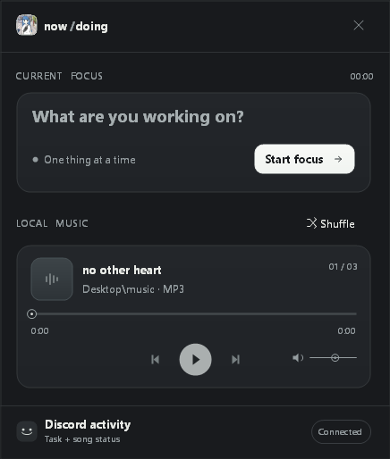

# studying

i made a small windows app where i can set what im studying and has its own local mini music player. it shows what im studying (task i set on the app) and the song im actively listening to on my discord status.

## the app

## what it looks like on discord

## using it

- download [studying.exe](studying.exe) and open it on windows. it needs .net framework 4.8.
- if you want music, put your songs in a `music` folder on your desktop. it plays them in file name order, or you can press shuffle. after the last song it starts again from the first one. the volume stays where you set it when the song changes.
- type what youre studying and press **start focus**. discord will show `studying [your task]` and, while a song is playing, `listening to [file name]`. the timer shows how long youve been studying.
- keep the discord desktop app open. in discord, click the gear next to your name, open **activity sharing**, and turn on **share my activity**. [discord shows how to find it here](https://support.discord.com/hc/en-us/articles/7931156448919-Activity-Sharing-on-Discord-FAQ). you dont need to make your own discord app or add an id.
- press the x in the top right to quit.

your songs stay on your pc. the app reads them from `Desktop\music` and saves its settings in `%LOCALAPPDATA%\NowAndDoing\settings.json`.

## building it

on windows, run `powershell -ExecutionPolicy Bypass -File .\build.ps1` from this folder. it puts the new app in `dist\studying.exe`.
